  

## 01 · Identity

I don't build demos — I ship complete products: designed, engineered, tested, deployed, and used in real life.

Right now that means a drivable 3D portfolio island running on WebGPU with real physics and synthesized audio; **FORGE**, an AI-powered performance ledger that turns messy daily notes into visible progress; a production-shaped community marketplace; and macOS utilities I actually use every day.

I care about the whole path — the data model, the server-only API gateway, the motion design, the test suite, the deploy. A product isn't done when it compiles; it's done when it feels good to use.

On GitHub since 2024 · AI/ML student · Mumbai, India. Everything on this page was learned by building it.

## 02 · What I Build

### Playable Portfolio — *don't scroll a résumé. Drive it.*
> A drivable 3D island where nine districts hold 16 interactive exhibits — every district, terminal and monument is a real project. Arcade kart physics on Rapier WASM, a WebGPU renderer with WebGL2 fallback, and a world generated entirely from code: terrain, roads, buildings, sounds and sky — zero downloaded 3D models, zero audio files.
>
> `TypeScript (strict)` `three.js / WebGPU` `Rapier WASM` `Web Audio` — [**Live ↗**](https://taher-portfolio-3d.vercel.app) · *private build*

### FORGE — *paste today's note, see real progress, in under 20 seconds*
> A local-first gym & nutrition ledger that parses messy Apple Notes into structured progress, then adds grounded AI insights through a server-only NVIDIA GLM gateway with zod-validated responses. Supabase Postgres behind a server-only `/api` gateway, hand-built SVG charts, 37 unit + 20 e2e tests — and it fails soft without an API key.
>
> `Next.js 16` `React 19` `TypeScript (strict)` `Supabase` `NVIDIA AI` `Vitest · Playwright` — [**Live ↗**](https://gym-nutrition-khaki.vercel.app) · *private build*

### HunarMart — *a production-shaped community marketplace, 120+ routes*
> A two-sided marketplace for home chefs and makers: merchant onboarding with KYC/FSSAI approvals, storefronts with trust cards, a multi-maker cart with UPI/COD, order tracking, QR-scan attribution, and separate merchant + ops consoles. All 120+ routes prerender, and the codebase maps directly to its business plan and P0–P5 roadmap.
>
> `Next.js 16` `Tailwind v4` `Recharts` `TypeScript` · *private build*

### Security Breach Simulator — *train incident response against realistic breaches*
> Seven breach scenario families (ransomware, zero-day, supply chain, insider threat…), deterministic seeded generation, and A–F scoring across detection time, action efficiency and policy compliance — with trend dashboards and JSONL audit logging. Containerized, fully type-annotated, REST API included.
>
> `Python` `FastAPI` `Docker` `GitHub Actions` — [**Source ↗**](https://github.com/taher53-s/security-breach-simulator)

### nvim-plugin-marketplace — *an in-editor marketplace built from raw buffers*
> A Neovim plugin marketplace UI built entirely with Lua buffers and floating windows — no framework, just the editor's own primitives. A custom `:Marketplace` command opens a floating-window interface for discovering plugins without leaving vim.
>
> `Lua` `Neovim API` — [**Source ↗**](https://github.com/taher53-s/nvim-plugin-marketplace)

### Stash — *a temporary shelf for your files, shake to summon*
> An open-source macOS utility: drag files, shake the mouse, and a shelf appears to stash them until you reach the destination folder. Global shake detection, a native SwiftUI interface, a Swift Package Manager build — no Xcode required. Runs entirely locally.
>
> `Swift` `SwiftUI` `SPM` — [**Source ↗**](https://github.com/taher53-s/Stash)

### Live systems

Real URLs, visited by real people — production client work included:

| system | what it is | |
|---|---|---|
| **International Paints** | production client site — Mumbai paints business | [visit ↗](https://international-paints.vercel.app) |
| **Caretakers PMC** | production client site — Mumbai property services | [visit ↗](https://caretakerspmc.vercel.app) |
| **Playable Portfolio** | the drivable 3D portfolio island | [visit ↗](https://taher-portfolio-3d.vercel.app) |
| **FORGE** | AI-powered performance ledger | [visit ↗](https://gym-nutrition-khaki.vercel.app) |
| **FoodLog** | food & restaurant journal with analytics | [visit ↗](https://food-journal-phi.vercel.app) |
| **Kronos** | entertainment tracker — every story you've lived through | [visit ↗](https://kronos-kohl-nu.vercel.app) |

## 03 · The Ecosystem

  

Every node is a real system built end to end, and all of them connect to the same core: shipping complete products. The map is literal, too — the Playable Portfolio is a drivable island whose districts hold these exact systems.

## 04 · Activity

  

Generated from the GitHub GraphQL API by [`scripts/generate_activity.py`](scripts/generate_activity.py) and refreshed weekly by [GitHub Actions](.github/workflows/profile-update.yml) — every number computed from real data, no third-party stat cards.

## 05 · Stack

| | technologies |
|---|---|
| **languages** | TypeScript · Python · Swift · Java · Lua · SQL |
| **AI & data** | NVIDIA AI (GLM, zod-validated) · Hadoop · Hive · Sqoop · Supabase / Postgres |
| **product** | Next.js (App Router) · React · Tailwind · three.js / WebGPU · Framer Motion · PWA |
| **platform & ops** | Vercel · Docker · GitHub Actions · Vitest · Playwright |
| **native & tools** | SwiftUI / SPM · Neovim / Lua · Django · FastAPI |

## 06 · Now

<!-- @BEGIN:now -->
| now | focus |
|---|---|
| **building** | FORGE — an AI-powered performance ledger (gym + nutrition), Next.js 16 + NVIDIA GLM + Supabase · Playable Portfolio — a drivable 3D island where every district is a real project |
| **learning** | WebGPU render pipelines & compute-driven effects (shipped with fallbacks in the 3D portfolio) · Agentic workflows — multi-skill agent systems wired into real tooling |
| **exploring** | Local-first product architecture (offline-first PWA + server-synced Postgres) · Procedural generation — terrain, audio and worlds built entirely from code |
| **open to** | Product engineering internships / junior roles (full-stack, AI/ML) · Freelance product builds — end to end, design to deployment |
<!-- @END:now -->

*This table is generated from [`data/profile.yml`](data/profile.yml) — update it there, never in the README.*

## 07 · Contact

[**github.com/taher53-s**](https://github.com/taher53-s) · [**portfolio — drivable**](https://taher-portfolio-3d.vercel.app) · [**tahersohagpurwala@gmail.com**](mailto:tahersohagpurwala@gmail.com) · open a discussion on any repo above

---

This profile is a small system: the hero and ecosystem map are hand-drawn SVG, the activity card is generated from live data by Python, and a scheduled workflow keeps it honest. Built by hand — no template, no badge walls, no third-party stat cards.
